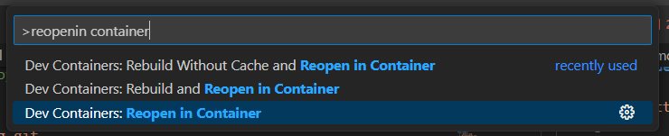
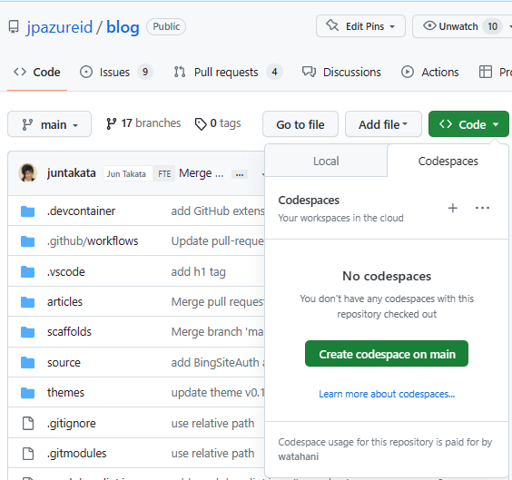

# Blog Example

[template] Microsoft CSS Japan example blog repository.

## Getting Started

[Getting Started](./docs/getting-started.md)

## Init / Update blog theme

https://github.com/jpazureid/hexo-theme-jpazure

```shell
git submodule update -i
```

## Start / Stop Hexo server (local-preview)

```shell
docker-compose up

# Ctrl+C
docker-compose down
```

## Writing the blog in devcontainer

If you want to write a blog in devcontainer, install Visual Studio Code and [Dev Container Extension](https://marketplace.visualstudio.com/items?itemName=ms-vscode-remote.remote-containers).

After that, open the repository with Visual Studio Code and select `Reopen in Container` from the command palette.



In Dev Container, you can start the Hexo server just push `F5` key. (or select `Run and Debug` from the command palette)

You can also use Dev Container experience in GitHub Codespaces. After deploying, go to your own blog repository (`https://github.com/<yourorg>/blog`) and select `Code` -> `Codespaces` -> `Create codespace on main` from the menu.



## Directory structure

```
example
├── .devcontainer
│   ├── devcontainer.json # Dev Container configuration include recommended extensions
│   └── docker-compose.yml
├── .github
│   └── workflows      # Workflows for GitHub Actions
│       └── upload-gh-pages.yml
├── .gitignore
├── .textlintrc
├── postCreateCommand.sh # script invoked when devcontainer is created
├── README.md
├── _config.yml        # Site configration
├── articles           # Blog articles
│   └── information
│       └── test.md    # Example post
├── docker-compose.yaml    # Configuration for containers (local-preview)
├── docs               # Documents
├── github-issue-template.md
├── scaffolds
├── source
└── themes             # Blog themes
    └── jpazure (git submodule)
```
